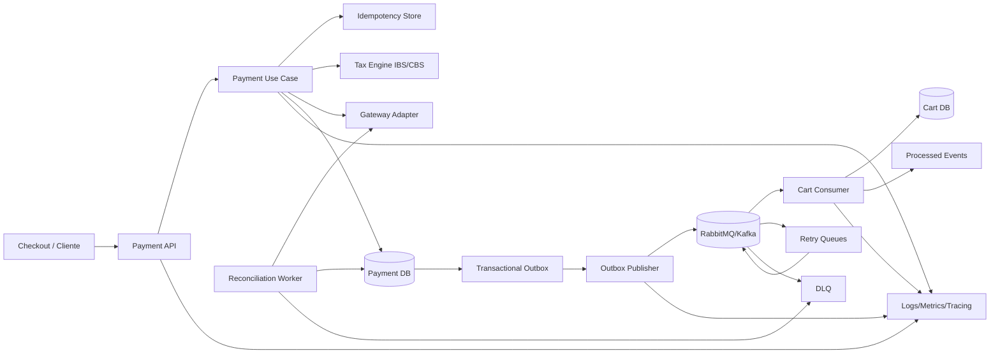

# Plano de Melhorias — Payment Service

**Versão:** 1.0.0  
**Status:** Proposta técnica para aprovação  
**Autor:** Manus AI  
**Base:** análise da documentação e da conversa compartilhada [1]

> Este documento transforma as recomendações de melhoria em um plano executável, seguindo a lógica SDD: especificação, decisão arquitetural, implementação incremental, verificação e registro de progressão.

## 1. Objetivo

O objetivo é elevar o Payment Service de uma especificação arquitetural inicial para uma solução preparada para produção, com garantias mais fortes de consistência financeira, idempotência, rastreabilidade, segurança, governança tributária, operação de retries e tratamento de mensagens em DLQ.

As melhorias foram priorizadas pelos riscos mais graves: cobrança duplicada, divergência entre pagamento e Carrinho, perda de eventos, transições financeiras inválidas, retry inseguro após timeout do gateway, regras fiscais não reproduzíveis e DLQ sem operação definida.

## 2. Diagnóstico da situação atual

A solução existente já estabelece bons fundamentos: Go, Clean Architecture, tokenização de cartão, Redis para idempotência, motor tributário desacoplado, RabbitMQ/Kafka como opções de mensageria, retries, DLQ e documentação OpenAPI. Entretanto, parte desses elementos está descrita em nível conceitual e ainda precisa de contratos, persistência, testes e procedimentos operacionais.

| Área | Situação atual | Necessidade |
|---|---|---|
| Idempotência | Redis com TTL de 24 horas | Complementar com registro durável, hash de payload e restrição única |
| Consistência | Outbox mencionada | Definir transação, publicador, confirms e reconciliação |
| Dinheiro | Existia uso de `float64` no modelo inicial | Migrar para menor unidade monetária ou decimal exato |
| Tributos | IBS/CBS desacoplados conceitualmente | Versionar regras, entradas, vigência, cálculo e auditoria |
| Estados | `APPROVED`, `REJECTED`, `PENDING` | Formalizar máquina de estados e separar captura, cancelamento e reembolso |
| Retries | Filas de atraso e limite definidos | Diferenciar gateway, mensageria e reconciliação; adicionar jitter |
| DLQ | Fila final descrita | Criar ownership, alertas, retenção, replay e auditoria |
| Eventos | `PaymentProcessed` genérico | Criar envelope versionado e política de compatibilidade |
| Segurança | Tokenização e ausência de PAN/CVV | Completar threat model, proteção de webhook e gestão de segredos |
| Operação | Métricas sugeridas | Criar SLOs, dashboards, alertas e runbooks |
| Qualidade | Testes listados | Implementar testes de concorrência, falhas, contrato e integração |

## 3. Arquitetura-alvo

A arquitetura-alvo mantém Clean Architecture, mas adiciona uma camada explícita de confiabilidade financeira e operacional.



A decisão essencial é que o banco durável seja a fonte de verdade da transação financeira. Redis será utilizado para acelerar a reserva e a consulta de idempotência, mas não deverá ser o único registro da cobrança. O evento assíncrono deverá nascer na mesma transação que grava o pagamento.

## 4. Melhorias prioritárias

### 4.1 Outbox transacional e reconciliação

O Payment Service deve gravar o pagamento, o cálculo tributário e o evento Outbox na mesma transação de banco. O publicador lê eventos pendentes, publica no broker com confirmação e atualiza o estado da Outbox.

A Outbox deve possuir, no mínimo, `event_id`, `aggregate_id`, `event_type`, `payload`, `status`, `attempt_count`, `next_attempt_at`, `last_error`, `created_at`, `published_at` e `locked_at`.

| Estado da Outbox | Significado |
|---|---|
| `PENDING` | Evento aguardando publicação |
| `PUBLISHING` | Evento reservado por um worker |
| `PUBLISHED` | Broker confirmou a publicação |
| `FAILED_RETRYABLE` | Falha temporária, aguardando nova tentativa |
| `FAILED_PERMANENT` | Falha que exige intervenção |

A reconciliação deverá executar consultas periódicas para detectar pagamentos sem evento, eventos pendentes antigos, pagamentos com status incerto no gateway e divergências entre o valor interno e o valor externo.

### 4.2 Idempotência durável

A chave de idempotência deve ser armazenada com escopo explícito, por exemplo, `merchant_id + operation + idempotency_key`. O registro deverá conter o hash canônico do payload, estado da operação, resposta serializada, código HTTP, `transaction_id`, timestamps e expiração.

```sql
CREATE UNIQUE INDEX uq_idempotency_scope
ON idempotency_records (merchant_id, operation, idempotency_key);
```

O fluxo recomendado é:

1. Validar o header `Idempotency-Key`.
2. Canonicalizar o payload.
3. Calcular seu hash.
4. Tentar inserir o registro com estado `PROCESSING`.
5. Se já existir, comparar o hash.
6. Devolver a resposta armazenada quando a operação estiver concluída.
7. Devolver `202` ou `409` quando outra requisição ainda estiver processando, conforme a política aprovada.
8. Persistir a resposta final junto ao resultado financeiro.

O Redis pode manter uma cópia rápida com TTL de 24 horas. O banco deve preservar a evidência necessária para reconciliação e prevenção de conflitos.

### 4.3 Valores monetários exatos

Todos os valores devem usar a menor unidade monetária em `int64`, como centavos em BRL, ou uma biblioteca decimal apropriada quando a regra exigir mais precisão. O contrato deve declarar a unidade em todos os campos.

A especificação deve definir:

| Regra | Decisão necessária |
|---|---|
| Escala | Menor unidade da moeda ou decimal fixo |
| Arredondamento | Por item, componente tributário ou total |
| Precisão tributária | Casas intermediárias e finais |
| Conversão | Taxa, data e fonte quando houver moeda estrangeira |
| Limites | Valor mínimo, máximo e overflow |

### 4.4 Máquina de estados financeira

As transições devem ser controladas no domínio e persistidas em uma tabela de histórico.

| Estado | Operação permitida | Próximo estado |
|---|---|---|
| `CREATED` | Enviar cobrança | `PENDING` |
| `PENDING` | Gateway aprova | `AUTHORIZED` ou `APPROVED` |
| `PENDING` | Gateway rejeita | `REJECTED` |
| `AUTHORIZED` | Capturar | `CAPTURED` |
| `AUTHORIZED` | Cancelar | `CANCELLED` |
| `CAPTURED` | Reembolsar integralmente | `REFUNDED` |
| `CAPTURED` | Reembolsar parcialmente | `PARTIALLY_REFUNDED` |
| `REJECTED` | Nova tentativa autorizada | Nova tentativa vinculada |

Cada operação deve ter uma chave de idempotência própria. A autorização não deve ser confundida com captura, cancelamento ou reembolso.

### 4.5 Retries e resultado incerto do gateway

Os retries devem ser divididos em três políticas independentes:

| Política | Aplicação | Regra |
|---|---|---|
| Gateway | Erro HTTP 5xx, timeout antes de confirmação | Retry limitado e idempotente |
| Mensageria | Falha temporária do consumidor | Retry com backoff, jitter e DLQ |
| Reconciliação | Timeout após possível recebimento pelo gateway | Consultar status antes de cobrar novamente |

Nunca deve ser feita uma nova cobrança cega quando o gateway pode ter recebido a solicitação. O adaptador deve enviar uma chave idempotente ao gateway ou consultar a transação externa pelo identificador da tentativa.

A política recomendada é backoff exponencial com jitter:

```text
atraso = min(base * 2^tentativa + jitter, limite)
jitter = valor aleatório entre 0 e 20% do atraso calculado
```

### 4.6 DLQ operacional

A DLQ deve possuir retenção, alertas, ownership e replay seguro. Cada entrada deve registrar o `event_id`, causa sanitizada, contador de tentativas, primeira falha, última falha, serviço consumidor, schema e correlação.

O replay deve ser uma operação controlada, com seleção por evento, validação prévia, limite de velocidade, auditoria e prevenção de loop. Mensagens que falharem novamente durante o replay devem receber um novo registro de tentativa e permanecer rastreáveis.

### 4.7 Contrato de eventos versionado

O evento deve possuir envelope estável e dados específicos da transição.

```json
{
  "event_id": "evt-123",
  "event_type": "PaymentApproved",
  "schema_version": 1,
  "producer": "payment-service",
  "occurred_at": "2026-08-10T14:00:00Z",
  "correlation_id": "corr-456",
  "causation_id": "cmd-789",
  "data": {
    "transaction_id": "txn-123",
    "order_id": "order-456",
    "status": "APPROVED",
    "amount_minor": 19990,
    "currency": "BRL",
    "taxes": {
      "ibs_amount": 1000,
      "cbs_amount": 500,
      "total_tax": 1500,
      "rule_version": "2026-01"
    }
  }
}
```

Eventos recomendados: `PaymentPending`, `PaymentApproved`, `PaymentRejected`, `PaymentCancelled`, `PaymentCaptured`, `PaymentRefunded` e `PaymentPartiallyRefunded`. O Carrinho deve reagir somente aos eventos que fazem parte de seu contrato.

## 5. Tributação IBS/CBS

O motor tributário deve ser tratado como um componente versionado e auditável. A função mínima não deve receber apenas valor e estado; deve receber um contexto tributário completo.

```go
type TaxCalculationInput struct {
    AmountMinor       int64
    Currency           string
    CountryCode        string
    StateCode          string
    CityCode           string
    ProductType        string
    CustomerType       string
    TaxRegime          string
    EffectiveAt        time.Time
    RequestedVersion   string
}

type TaxCalculationResult struct {
    IBSAmountMinor     int64
    CBSAmountMinor     int64
    TotalTaxMinor      int64
    BaseAmountMinor    int64
    RuleVersion        string
    Jurisdiction       string
    CalculatedAt       time.Time
    Breakdown          []TaxBreakdown
}
```

Cada pagamento deve guardar a versão da regra usada. As regras devem ter vigência, status, fonte de aprovação e testes de regressão. Alterações futuras não podem modificar o resultado histórico já persistido.

> A parametrização legal de IBS/CBS deve ser aprovada por especialistas tributários. O serviço deve registrar a regra utilizada, mas não deve inventar ou inferir automaticamente obrigações fiscais sem uma fonte oficial e uma decisão formal.

## 6. Segurança e privacidade

A tokenização permanece obrigatória. O serviço não deve aceitar PAN ou CVV. O token do gateway também deve ser classificado, mascarado e protegido conforme o contrato do provedor.

Melhorias obrigatórias:

| Controle | Implementação |
|---|---|
| Segredos | Secret manager, rotação e segregação por ambiente |
| Webhooks | HMAC, timestamp, nonce e prevenção de replay |
| Logs | Redaction de cartão, token, credenciais e payloads sensíveis |
| Acesso | Scopes por comerciante, operação e ambiente |
| Rede | TLS, egress controlado e segmentação |
| Dependências | SCA, atualizações e verificação de vulnerabilidades |
| Auditoria | Histórico de transições sem dados sensíveis |
| Rate limit | Limite por cliente, IP, comerciante e endpoint |

## 7. Observabilidade e SLOs

A solução deve propagar `traceparent`, `correlation_id`, `transaction_id` e `event_id` entre HTTP, banco, gateway e broker. Os logs devem ser estruturados e conter somente informações necessárias para diagnóstico.

| Indicador | Objetivo operacional |
|---|---|
| Latência p95 de criação | Medir experiência do checkout |
| Taxa de aprovação | Avaliar gateway e negócio |
| Conflitos de idempotência | Detectar integração incorreta |
| Pagamentos pendentes | Detectar resultados incertos |
| Idade da Outbox | Detectar atraso de publicação |
| Idade da DLQ | Detectar falhas não tratadas |
| Taxa de retry | Detectar instabilidade |
| Divergências de reconciliação | Detectar risco financeiro |
| Falhas IBS/CBS | Detectar problemas de regra ou entrada |

Deverão existir dashboards, alertas e runbooks para Redis, banco, gateway, broker, Outbox, DLQ e reconciliação.

## 8. Contratos de API e OpenAPI

A OpenAPI deve ser tratada como contrato versionado no repositório. O CI deve executar lint, validar referências, gerar documentação e executar testes de contrato.

Melhorias específicas:

1. Padronizar o formato de erro com `type`, `title`, `status`, `detail`, `instance` e `correlation_id`.
2. Documentar explicitamente repetição idempotente, conflito de payload e processamento concorrente.
3. Definir scopes de autenticação por endpoint.
4. Padronizar `X-Correlation-Id`, `Retry-After` e `Location`.
5. Documentar unidade monetária e arredondamento.
6. Descrever a máquina de estados.
7. Documentar assinatura, timestamp e replay de webhooks.
8. Manter schemas de eventos compatíveis com a API.

## 9. Plano de implementação em fases

### Fase 1 — Fundação de dados e domínio

Migrar valores monetários, criar máquina de estados, tabelas de histórico, registros de idempotência e estrutura de cálculo tributário. Implementar testes unitários de todas as invariantes.

**Saída:** domínio compilável, migrações e testes de estado/idempotência.

### Fase 2 — Consistência transacional

Implementar pagamento + cálculo tributário + Outbox na mesma transação. Criar publicador com publisher confirms, lock de eventos e retries de publicação.

**Saída:** nenhum pagamento aprovado sem evento rastreável ou estado de reconciliação.

### Fase 3 — Gateway resiliente

Adicionar chave idempotente externa, classificação de erros, circuit breaker, backoff com jitter e worker de reconciliação para resultados incertos.

**Saída:** nenhuma nova cobrança cega após timeout ambíguo.

### Fase 4 — Mensageria e DLQ

Implementar envelope versionado, consumidor idempotente, filas de retry, DLQ, métricas, alertas e ferramenta de replay.

**Saída:** todas as mensagens possuem caminho de sucesso, retry ou DLQ rastreável.

### Fase 5 — Segurança e observabilidade

Implementar redaction, assinatura de webhook, scopes, tracing, métricas, dashboards, alertas, gestão de secrets e threat model.

**Saída:** operação observável e sem exposição de dados sensíveis.

### Fase 6 — Validação e produção controlada

Executar testes de integração, contrato, concorrência, carga, falha e segurança. Fazer rollout progressivo, acompanhar métricas e manter rollback documentado.

**Saída:** evidências de aceite, runbooks aprovados e liberação controlada.

## 10. Critérios de aceite

### Idempotência

Duas requisições concorrentes com a mesma chave devem produzir uma única cobrança externa. A repetição com payload idêntico deve devolver a mesma resposta. A mesma chave com payload diferente deve gerar `409`.

### Consistência

O pagamento e o evento Outbox devem ser gravados atomicamente. Um erro posterior na publicação deve deixar o evento pendente e recuperável. A reconciliação deve localizar qualquer pagamento aprovado sem evento publicado.

### Gateway

Um timeout após envio deve acionar consulta de status ou reconciliação, não uma cobrança cega. Erros permanentes não devem ser repetidos indefinidamente.

### Mensageria

Falhas transitórias devem seguir para retry com limite. Falhas permanentes devem ir diretamente para DLQ. Um evento duplicado não pode duplicar a atualização do Carrinho.

### Tributação

O resultado deve guardar IBS, CBS, total, base, jurisdição, versão da regra e timestamp. O mesmo input com a mesma versão deve produzir resultado reproduzível.

### Segurança

Não deve existir PAN ou CVV em banco, logs, mensagens, traces, métricas, DLQ ou arquivos temporários. Webhooks sem assinatura válida ou com timestamp inválido devem ser rejeitados.

## 11. Estratégia de testes

| Tipo | Cenários |
|---|---|
| Unitário | Estados, dinheiro, idempotência, cálculo e classificação de erros |
| Concorrência | Mesma chave simultânea e eventos duplicados |
| Integração | Banco, Redis, broker, gateway simulado e Outbox |
| Contrato | OpenAPI e schemas de eventos |
| Resiliência | Timeout, indisponibilidade, reconexão, retry e DLQ |
| Segurança | Redaction, webhook, autenticação, autorização e secrets |
| Carga | Alto volume, latência, prefetch e saturação |
| Reconciliação | Pagamento sem evento, evento duplicado e resultado ambíguo |
| Fiscal | Versões, vigências, arredondamento e regressão |

## 12. ADRs obrigatórios

Antes da implementação final, devem ser aprovados os seguintes registros de decisão arquitetural:

| ADR | Decisão |
|---|---|
| ADR-001 | Banco e estratégia de transação |
| ADR-002 | RabbitMQ ou Kafka |
| ADR-003 | Modelo de Outbox e publicação |
| ADR-004 | Escopo e persistência da idempotência |
| ADR-005 | Máquina de estados e operações financeiras |
| ADR-006 | Estratégia de retry do gateway |
| ADR-007 | Estratégia de retry da mensageria e DLQ |
| ADR-008 | Versionamento das regras IBS/CBS |
| ADR-009 | Contrato e evolução dos eventos |
| ADR-010 | Segurança de webhooks e gestão de secrets |
| ADR-011 | SLOs, observabilidade e runbooks |

## 13. Progressão SDD

| Etapa | Entregável | Condição para avançar |
|---:|---|---|
| 1 | Requisitos e riscos atualizados | Requisitos críticos identificados |
| 2 | ADRs aprovados | Decisões irreversíveis registradas |
| 3 | Contratos OpenAPI e eventos | Schemas revisados e versionados |
| 4 | Modelo de domínio | Estados e invariantes testados |
| 5 | Infraestrutura de dados | Migrações e índices validados |
| 6 | Caso de uso resiliente | Idempotência e gateway testados |
| 7 | Outbox e mensageria | Publicação e consumo confirmados |
| 8 | DLQ e operação | Replay, alertas e ownership definidos |
| 9 | Segurança e observabilidade | Threat model, métricas e dashboards disponíveis |
| 10 | Produção controlada | Critérios de aceite e rollback aprovados |

## 14. Ordem recomendada de execução

A ordem recomendada é: **Outbox transacional e idempotência durável**, depois **máquina de estados e valores monetários**, em seguida **gateway resiliente e reconciliação**, depois **mensageria, retries e DLQ**, e finalmente **segurança, observabilidade, testes de carga e rollout**.

Essa ordem reduz o risco de construir uma mensageria aparentemente robusta sobre uma base financeira sem consistência. Também permite validar primeiro os riscos que podem gerar perda financeira ou cobrança duplicada.

## 15. Definição de pronto para produção

O sistema somente deverá ser considerado pronto quando possuir contratos versionados, banco durável, idempotência testada sob concorrência, valores exatos, máquina de estados, Outbox transacional, reconciliação, retries limitados, DLQ operável, regras tributárias versionadas, webhook protegido, observabilidade, runbooks, pipeline de segurança e evidências de testes.

A aprovação deve ser baseada em uma matriz de rastreabilidade que relacione cada requisito a uma decisão, implementação, teste e evidência de execução.

## Referências

[1]: https://manus.im/share/0o55Q3fHjBwBIM7nwxzRKn "Conversa compartilhada — documentação do Payment Service"
[2]: https://www.rabbitmq.com/docs/dlx "RabbitMQ — Dead Letter Exchanges"
[3]: https://www.rabbitmq.com/docs/confirms "RabbitMQ — Consumer Acknowledgements and Publisher Confirms"
[4]: https://spec.openapis.org/oas/latest.html "OpenAPI Specification"
